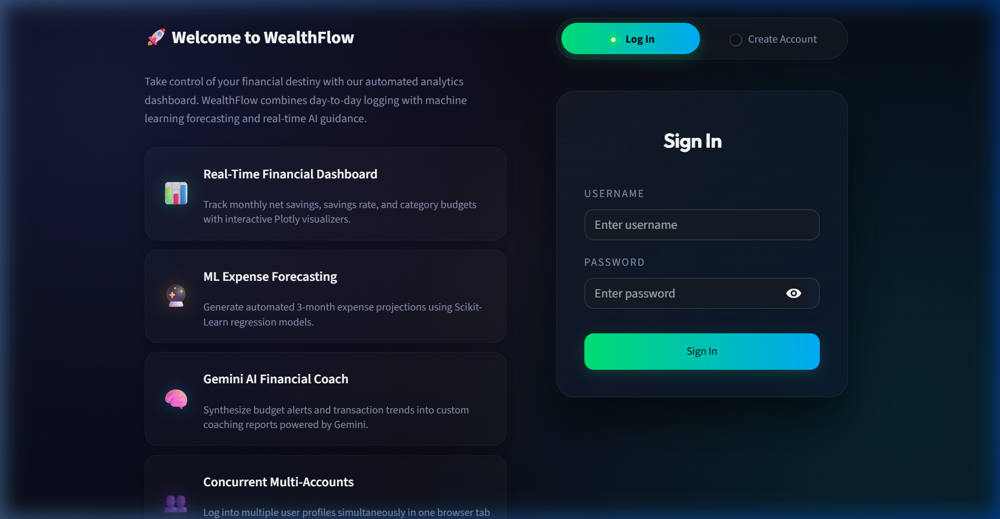
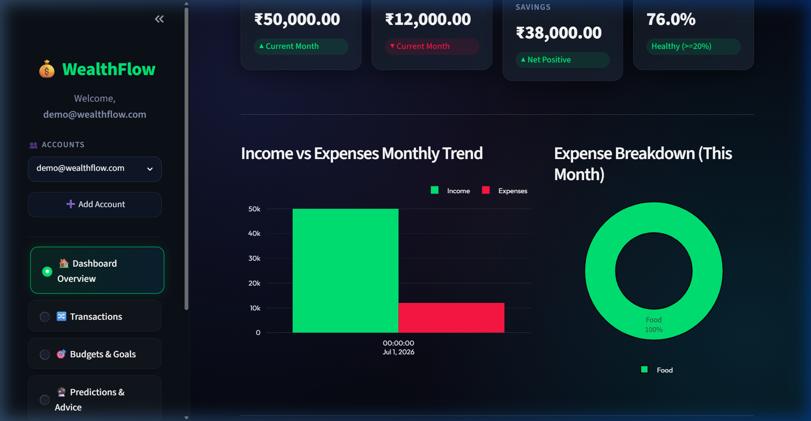
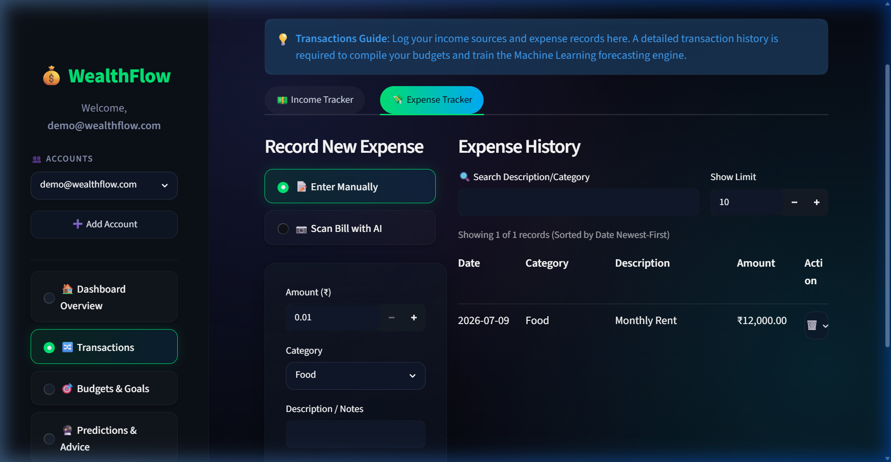
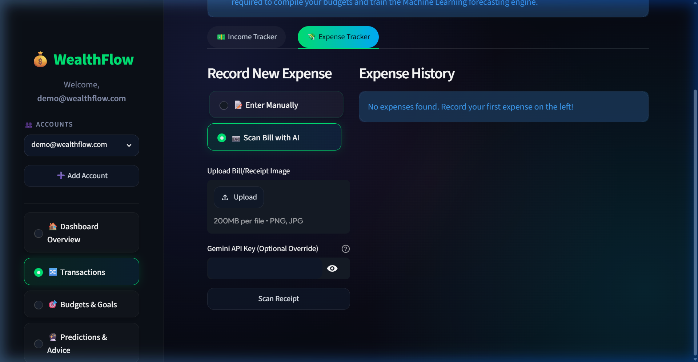
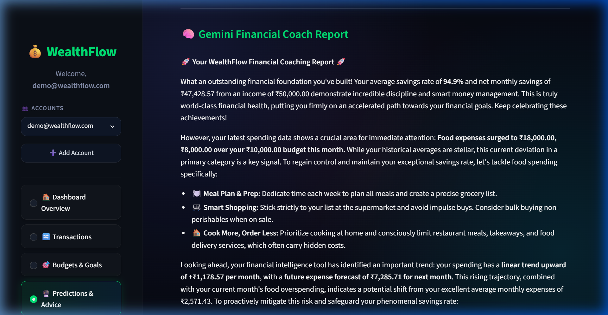

# WealthFlow Project Presentation Slides

This document contains the exact slide-by-slide copy-paste content for your **WealthFlow Personal Finance Board** project presentation, matching the structure, order, and topics of the **JourneyAI** slides.

Actual captured screenshots from your running Streamlit application have been embedded under the respective user interface slides so you can easily include them in your PowerPoint.

---

## Slide 1: Cover Page
*   **Project Title:** Project Report on WealthFlow: Personal Finance Management Board
*   **Subheading:** Undertaken at personal workspace/JIIT
*   **Dates:** 9th June 2025 - 21st July 2025
*   **Submitted by:** Himank Mahani, MCA (2026), JIIT Noida
*   **Under the Guidance of:** Aviral Gupta (Senior Software Engineer)

---

## Slide 2: Acknowledgement
*   **Slide Text:**
    I would like to express my sincere gratitude to everyone who contributed to the successful completion of the **WealthFlow** personal finance board project. Special thanks to my mentors for their continuous guidance and support throughout the process. I am also grateful to my peers for their valuable feedback and encouragement. The use of open-source technologies, cloud database APIs, and generative models played a crucial role in bringing this project to fruition. Finally, I appreciate the opportunity to apply and expand my full-stack engineering skills through this development experience.

---

## Slide 3: Certificate
*   *(Format this as a placeholder slide where you can insert your internship/project certificate)*

---

## Slide 4: About the Project
*   **Bullet Points:**
    *   An innovative solution for next-generation automated wealth tracking and personal budgeting.
    *   Uses secure database integrations for concurrent cloud account synchronization.
    *   Emphasizes computational efficiency and machine learning to replace retrospective tracking with predictive planning.
    *   Leverages generative AI for receipt parsing and personal financial coaching.

---

## Slide 5: Table of Contents (Part 1)
1. Abstract
2. Introduction
3. Software Used
4. Purpose of the Project
5. Scope of the Project
6. Features of the Project
7. Application of the Project

---

## Slide 6: Table of Contents (Part 2)
8. Diagrams
9. Workflow
10. User Interface Overview
11. Challenges Faced
12. Deployment
13. Conclusion
14. Preview Link
15. Bibliography

---

## Slide 7: Abstract
*   **Slide Text:**
    **WealthFlow** is an AI-powered personal finance dashboard built with Streamlit. It integrates Supabase PostgreSQL for secure database storage, a custom NumPy regression engine for predictive expense forecasting, and the Gemini API for automatic receipt scanning (OCR) and personalized financial coaching. By mapping transaction parameters, the system dynamically guides users' spending habits, bridging the gap between retrospective expense logging and active, predictive wealth management.

---

## Slide 8: Introduction
*   **Slide Text:**
    WealthFlow is a full-stack personal finance board designed to streamline how individuals track, analyze, and optimize their capital. The application provides users with interactive cashflow summaries, category budget limits, future expense trends, and automated receipt uploading. By combining a custom NumPy-based machine learning linear regression solver with Google's Gemini-2.5-flash model, WealthFlow automates transaction categorization and provides users with proactive, context-aware financial advice.

---

## Slide 9: Software Used - Frontend
*   **Bullet Points:**
    *   **Streamlit (v1.30.0+):** Python framework used to build a highly responsive single-page application dashboard.
    *   **Plotly Express:** Used for rendering interactive, high-fidelity spending charts (donuts, lines, and bar charts).
    *   **Dynamic CSS Injection:** Injects dark-theme glassmorphism and clean typography (Google Fonts - Outfit) into Streamlit.
    *   **HTML Markdown:** Custom HTML containers for modern cards, transaction lists, and budget bars.

---

## Slide 10: Software Used - Backend & Databases
*   **Bullet Points:**
    *   **Python (v3.14):** Core execution language and data engine.
    *   **NumPy & Pandas:** Handled transaction data structures and custom matrix algebra.
    *   **Supabase PostgreSQL / SQLite:** Cloud-hosted relational database syncing (Pgpooler) with local SQLite fallback.
    *   **Bcrypt:** Handles client-side password hashing and secure login authentication.
    *   **Dotenv:** Configures secure environment keys (Supabase URI, Gemini API Key).
    *   **Google Gemini API (`gemini-2.5-flash`):** Utilized for AI advice generation and Receipt OCR parsing.

---

## Slide 11: Purpose of the Project
*   **Bullet Points:**
    *   **Automate Ingestion:** Eliminate tedious typing of transaction details using image-based receipt scanning.
    *   **Predictive Insight:** Replace historical budget tracking with machine learning-driven future expense forecasts.
    *   **Actionable Advice:** Supply direct, qualitative budgeting recommendations rather than raw spreadsheet grids.
    *   **Secure Storage:** Ensure financial accounts and credentials are cryptographically protected.

---

## Slide 12: Scope of the Project (Part 1)
*   **Bullet Points:**
    *   **Account Authentication:** High-security user sign-in and account registration.
    *   **Asset Management:** Real-time synchronization across multiple accounts (Cash, Bank, Cards).
    *   **Category Budgets:** Limit definitions on specific spending areas with automated overspend triggers.
    *   **Time-Series Regression:** Forecasting total monthly expenses based on preceding historical data.

---

## Slide 13: Scope of the Project (Part 2)
*   **Bullet Points:**
    *   **Gemini Receipt OCR:** Direct file-uploader supporting image byte parsing to extract merchant, date, and amount.
    *   **AI Personal Coach:** Custom generative prompts parsing regression slopes to advice cards.
    *   **Responsive Platform Layout:** Designed to scale fluidly from desktop monitors to mobile device screens.
    *   **Offline Fallback:** Secure SQLite operations when cloud database nodes are unreachable.

---

## Slide 14: Features of the Project (Part 1)
*   **Bullet Points:**
    *   **Vectorized Trend Forecasting:** Custom numerical linear solver computes expense trajectories and projects standard deviation boundaries for the next 3 months.
    *   **AI-Powered Receipt Parser:** Ingests receipt photos, runs multi-modal OCR, extracts values, and saves them to database categories automatically.

---

## Slide 15: Features of the Project (Part 2)
*   **Bullet Points:**
    *   **Active Overspent Alerts:** Visual indicators and custom warning banners trigger when spending exceeds user limits.
    *   **AI Financial Coaching:** Dynamically aggregates savings rate, income, expenses, and forecast indicators to synthesize custom behavioral improvements.
    *   **Multi-Account Tracking:** Consolidated net worth displays across checkings, cash reserves, and investment categories.

---

## Slide 16: Application of the Project
*   **Bullet Points:**
    *   **Individual Budgeting:** For students and professionals looking to optimize cashflow.
    *   **Predictive Spending:** For users wanting to foresee upcoming monthly cost spikes.
    *   **Easy Entry:** For busy users who prefer photographing receipts over typing data.
    *   **AI Financial Coaching:** For anyone seeking structured, objective budgeting guidelines.

---

## Slide 17: Section Divider: Diagrams
*   *(Use this as a clean section divider slide in your presentation template with the text "System Diagrams & Database Architecture")*

---

## Slide 18: System Architecture Diagram
*   **Visual Layout Description (Draw this as a block diagram):**
    *   **User Interface Layer:** Streamlit Frontend (Outfit Typography, Plotly Charts)
    *   **Business Logic Layer:** Python Engine (`app.py`, `auth.py`, `ml_utils.py`)
    *   **API & Integration Layer:** Google Gemini API (OCR/Advice) & BCrypt Encryption
    *   **Data Storage Layer:** Supabase Cloud PostgreSQL / Local SQLite Database

---

## Slide 19: Database Diagram (Supabase/SQLite)
*   **Entities & Schemas:**
    *   `USERS` [`id` (PK), `username`, `password_hash`] (where `username` is unique, typically an email or a handle)
    *   `ACCOUNTS` [`id` (PK), `user_id` (FK), `name`, `type`, `balance`, `created_at`]
    *   `TRANSACTIONS` [`id` (PK), `user_id` (FK), `account_id` (FK), `amount`, `type`, `category`, `description`, `date`]
    *   `BUDGETS` [`id` (PK), `user_id` (FK), `category`, `limit_amount`, `created_at`]

---

## Slide 20: Data Flow Diagram (DFD)
*   **Flow Steps:**
    1.  **User Entry/Action:** User inputs credentials, adds a transaction, or uploads a receipt photo.
    2.  **Authentication Control:** Credentials verified via `bcrypt` against PostgreSQL table.
    3.  **Image Processing:** Receipt uploaded $\rightarrow$ bytes sent to Gemini Multi-modal API $\rightarrow$ structured JSON fields returned $\rightarrow$ saved to transactions database.
    4.  **Forecasting Analysis:** NumPy processes expense records $\rightarrow$ calculates trend lines $\rightarrow$ outputs forecasting coordinates.
    5.  **AI Advisor Synthesis:** Financial data + regression indicators structured into prompt $\rightarrow$ Gemini generates text summary $\rightarrow$ displayed to user interface.

---

## Slide 21: Workflow (Part 1)
*   **Workflow Steps:**
    *   **User Registration & Login:** Users create a secure profile or log in. Hashed passwords verified against cloud database storage.
    *   **Asset Configuration:** Users set up tracking categories (Cash, Cards, Checkings) with current balances.
    *   **Transaction Logging:** User logs a transaction manually or triggers the receipt uploader camera module.

---

## Slide 22: Workflow (Part 2)
*   **Workflow Steps:**
    *   **Limits Verification:** Logged expenses are checked against `BUDGET` thresholds, triggering warning indicators if limits are exceeded.
    *   **Numerical Analytics:** The system applies NumPy regression solver to calculate expenditure growth rates.
    *   **AI Coach Execution:** Generates personalized reports detailing saving guidelines, trend reviews, and overspent mitigations.

---

## Slide 23: Section Divider: User Interface Overview
*   *(Use this as a clean section divider slide in your presentation template with the text "User Interface Overview")*

---

## Slide 24: UI - Welcome / Registration Portal
*   **Slide Description:** Dark-themed glassmorphic auth page that replaces standard Streamlit sidebar templates with a clean, centralized landing portal.
*   **Screenshot Visual:**
    

---

## Slide 25: UI - Dashboard Overview
*   **Slide Description:** Displays top-level financial metrics (Net Worth, Income, Expense, Savings Rate) and the Plotly expenditure category distribution chart.
*   **Screenshot Visual:**
    

---

## Slide 26: UI - Transaction Ledger
*   **Slide Description:** Form module to log transactions manually and the tabular transaction database ledger display.
*   **Screenshot Visual:**
    

---

## Slide 27: UI - AI Receipt Scanner
*   **Slide Description:** Drag-and-drop file upload component that processes image binary bytes to automatically log categorized expenditures.
*   **Screenshot Visual:**
    

---

## Slide 28: UI - AI Coach, Forecasting & Budgets
*   **Slide Description:** Highlights the Plotly expenditure forecasting trend plot (with 95% confidence bounds), the active category budget status bars, and the Gemini coaching advisory cards.
*   **Screenshot Visual:**
    

---

## Slide 29: Challenges Faced (Part 1)
*   **Bullet Points:**
    *   **Library Loading Restrictions:** Strict application control policies on target systems blocked DLL loading for scientific packages like scikit-learn.
    *   **Workaround:** Programmed a custom, lightweight `LinearRegression` class directly in pure NumPy from scratch.
    *   **Consistent JSON Extraction:** Handling variability in Gemini OCR response strings to ensure they map correctly to database columns without crashing.
    *   **Workaround:** Implemented strict system instructions forcing the API model to only return schema-compliant JSON strings.

---

## Slide 30: Challenges Faced (Part 2)
*   **Bullet Points:**
    *   **Streamlit Page Refresh State:** Streamlit naturally reruns the script on each user interaction, losing inputs.
    *   **Workaround:** Integrated persistent key-value caching inside `st.session_state` to decouple page state from input submission.
    *   **PostgreSQL Connectivity:** Handling transient database pooler time-outs when updating records.
    *   **Workaround:** Integrated custom retry wrappers and set up a local SQLite fallback database.

---

## Slide 31: Deployment
*   **Bullet Points:**
    *   **Application Server:** Streamlit Cloud (headless container connected to GitHub repository main branch).
    *   **Database Host:** Supabase Cloud Infrastructure (AWS Singapore region PostgreSQL instances).
    *   **AI Models Gateway:** API requests processed by Gemini Generative AI endpoints.

---

## Slide 32: Conclusion
*   **Slide Text:**
    WealthFlow demonstrates the power of combining lightweight numerical computation and Large Language Models inside consumer personal finance boards. By moving beyond retrospective logging, the system leverages custom linear trend prediction and real-time generative coaching to provide proactive, actionable recommendations. The modular architecture provides a scalable foundation for future banking API sync integrations.

---

## Slide 33: Preview Link & Test Credentials
*   **Application Link:** Deployed live on Streamlit Cloud: `https://wealthflow.streamlit.app` (Insert your actual Streamlit URL here)
*   **Demo User Credentials:**
    *   **Email:** `demo@wealthflow.com`
    *   **Password:** `WealthFlowPass2026!`

---

## Slide 34: Bibliography
*   Streamlit Documentation: `https://docs.streamlit.io`
*   Supabase PostgreSQL Integration Guides: `https://supabase.com/docs`
*   Google Gemini API Reference: `https://ai.google.dev/docs`
*   NumPy and Pandas documentation on matrix regression: `https://numpy.org/doc`
*   Plotly Interactive Charts Library: `https://plotly.com/python`
